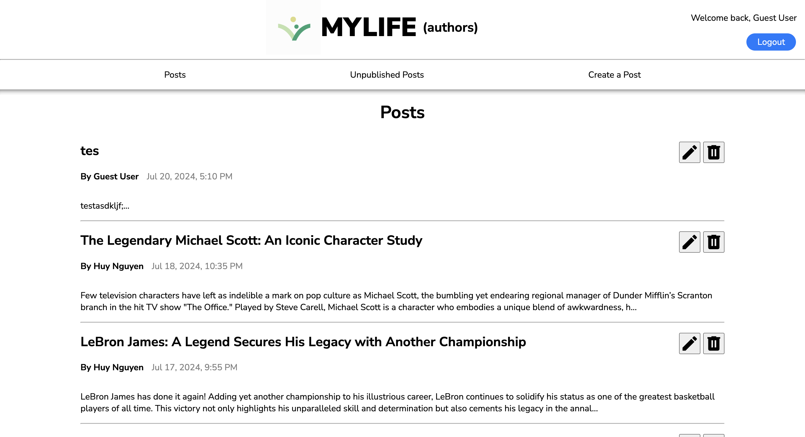

# Blog API

## Description

This web app consists of an API only backend and two different frontends. One frontend is for the author who can view, create, edit, and delete posts. The other frontend is for readers who can view the posts and put comments on them.

## Why?

The main purpose of this project was to practice setting up an API and accessing it from the outside. This project also gave me experience with
- RESTful organization
- Protecting routes with authentication
- Using a rich text editor (TinyMCE)
- Deploying a backend API, and a separate frontend
- React

## Live Sites

[Site for author of blog](https://soft-kitsune-e21c61.netlify.app/)
[Site for readers of blog](https://fastidious-pastelito-4c67ec.netlify.app/)

